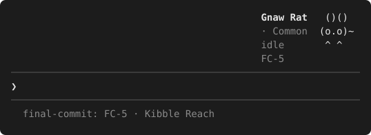

# The Final Commit

> *Space: the final commit.*

A mod for Claude Code that turns your real development work into a sci-fi
exploration game. Epics become star systems, issues become missions, and
finishing work turns up **Difflings**: procedurally generated alien flora and
fauna you contain, collect, and raise as companions. Optional puzzles built
from your own diffs improve your odds and double as interview practice.

It runs entirely in the terminal: ASCII art, keyboard only, 40 columns
minimum, playable over SSH and tmux, including from a phone.



*Your companion above the prompt, from a real game: name, tier, mood and
current mission beside its sprite, with the game's status line below.*

**Status: pre-alpha.** The first playable slice works: chart an epic, run
missions, meet and contain Difflings, keep a companion. Plan documents can
drive it, as can GitHub Issues. Jira and Linear sync, puzzles and crafting
come later. The design is in [docs/SPEC.md](docs/SPEC.md).

## Install

There is no release yet. To play from a clone, see
[Running the mod while developing](#running-the-mod-while-developing).

## How to play

| Command | What it does |
|---|---|
| `/epic NOVA-1` | Opens a form for the epic's title and description, then charts it as a star system in the background. |
| `/mission NOVA-12` | Starts a mission. Checking out a branch like `feature/NOVA-12-x` (in the epic's project) starts it too. |
| `/mission complete` | Finishes the mission. Tests passing during it earn a Reinforced Cell; an encounter may follow. A plain `npm test` counts by its exit status; a piped or guarded run (`npm test \| tail`) counts by the runner's summary line, so keep that line in the output. |
| `/contain [reinforced]` | Opens Seal the Lattice: press **Space** as the needle crosses the zone, **Enter** to throw the cell, **Esc** to pause. |
| `/calibrate` | Measures your key latency on this device, so timing is fair over SSH or from a phone. |
| `/bay`, `/bay companion N` | Lists your specimens and picks the companion shown above the prompt. |
| `/epic complete` | Surveys the epic: a guaranteed encounter, never a Common. |
| `/bridge` | The bridge: the active system and mission, hull (this session's test pass rate), shields (the last lint or type-check), fuel (context window left), crew status and the latest captain's log, with your companion at the foot. Keys send the crew: **e** run tests, **l** lint, **s** ask a question, **t** security review; the report opens when the run finishes. **1**, **2**, **3** reopen Engineering's, Science's or Tactical's last report (saved locally, including runs Claude sent). |
| Crew | Three read-only subagents Claude (or you) can dispatch: `final-commit:engineering` runs and explains tests, `final-commit:science` answers questions about the code, `final-commit:tactical` reviews your branch for security issues before a push. A clean Tactical review after your last commit raises the mission's quality (better odds of rarer Difflings). |
| `/captains-log` | Writes a short summary of the session (standup notes) and shows it in a pane. The last 20 are kept. |

A failed test run, or a failed tool call other than a shell command, during a
mission raises a red alert: the status line flashes, and a toast appears at
most once every five minutes.

### Plan documents

Instead of typing `/epic` and `/mission`, you can keep a markdown plan in
your project and let the game follow it. Add `plans` to `workSources` in
`/config`. The game then reads every `.md` file in `docs/plans/` (the
`plansFolders` setting) at session start and every 12 minutes:

```markdown
# NOVA-7 Billing export

Export invoices as files for the finance team.

- [x] NOVA-8 Write the exporter
- [~] NOVA-9 Schedule it
- [ ] NOVA-10 Document it
```

The first heading's key is the epic, and the text before the first task is
its description. Each task whose text starts with a key (or has one in
brackets) is a mission: `[~]` starts it, `[x]` finishes it, and all tasks
done surveys the epic. Tasks and plans without a key are skipped. The first
read only records where things stand, so work already done is not awarded.
Checking out a task's branch or typing `/mission` starts it too. Mark a task
`[~]` when you begin it: only work done while its mission is active counts,
so a task that goes straight to `[x]` completes without rewards.

### GitHub Issues

Add `github` to `workSources`, and list each repository with the prefix its
keys get in `githubRepos`: `example/nova=NOVA` makes issue #12 `NOVA-12`.
The game reads through the `gh` CLI and its own login, so `gh auth login`
first; the mod never handles a token. Every issue assigned to you is a
mission: being assigned starts it, and closing it finishes it (closing one
that is not your active mission only records it as closed, without
rewards). Its star system is its parent issue if it has one, else its
milestone (`NOVA-M3`), else the repo's backlog (`NOVA-BACKLOG`), so loose
tickets count too. Closing a parent or a milestone surveys its system. Name a branch with the key (`feature/NOVA-12-export`) and
checking it out starts the mission too.

## What data the mod sends, and where

The game is built from your own work, so some of it is sent to a model.

**What is sent to the model:** the epic title and description you type into
the `/epic` form (or a plan document's first heading and the prose before
its first task, or a GitHub parent issue's title and body, or a milestone's
title and description; a repo's backlog sends only the word "Backlog"),
after the privacy filter, in one request per epic (plus up
to two follow-up requests that redraw creature art; those carry generated
names and descriptions, not your text). The issue key is never sent. The
default model is Opus; you can pick Sonnet or Haiku in `/config`.
`/captains-log` asks your session's own model to summarize the session it
already holds; the mod adds only a fixed instruction, and the summary is
stored locally. The crew subagents read your code the way any Claude Code
subagent does, through your session's model and only when dispatched; the mod
supplies only their instructions.

**Where it goes:** only through your own Claude Code session and account.
Apart from the work sources you turn on (GitHub, through `gh`), the mod
makes no other network calls.

**What stays local:** the mod watches the Bash commands Claude runs in your
session (to notice branch switches, commits and test runs), runs `git` to read
the current branch, and reads `TERM`, `TMUX` and `SSH_CONNECTION` to tell your
devices apart for calibration (stored only as a salted hash). With the plans
source on, it reads the markdown files in your plan folders and keeps each
task's last status. With the github source on, it runs `gh api graphql` to
read the listed repositories' issues: that request goes to GitHub, through
gh, as any gh command does. Saved game data,
including your issue keys, stays in Claude Code's plugin store on this machine.

**What the model sees in the transcript:** slash commands and their output
are part of the session the model reads. That is why `/epic` takes only the
key and asks for the title in a form, and why command output is short and
factual (`Mission NOVA-12 complete.`). Issue keys you type in commands are
visible to the model.

**No telemetry. No analytics.** No data leaves your machine except as
described above.

**Privacy filter, on by default.** Before epic text reaches a prompt, the
filter replaces quoted text, issue keys, URLs, emails, IPs and hostnames,
phone numbers, SSN-, date- and ID-shaped values, ages, ZIP codes, and names
after a title (`Dr.`) or a role word (`patient`). The setting is `privacyMode`
in `/config`:

- `strict` (the default) also replaces every capitalized word that is not a
  common title word or technical acronym, which catches most names.
- `standard` keeps capitalized words, for better system theming.
- `off` sends the text as typed.

Known limit: a name written in lowercase in plain prose ("ask jane") cannot
be told from an ordinary word, in any mode. Keep names out of epic titles.

**Your responsibility:** check whether your employer permits sending work
content through Claude Code before pointing this mod at work projects.

## Contributing

This repository is public, and history is permanent. Never commit secrets,
real work content (employer or client names, real issue keys, ticket text),
hostnames, IPs, usernames, or local paths. Tests, fixtures, and examples use
invented projects with the issue key prefix `NOVA-`. See
[SPEC section 15](docs/SPEC.md#15-public-repository-guardrails).

### Local guardrail hooks

Two git hooks in `scripts/hooks/` block a commit before it happens:

- `pre-commit` scans staged changes with [gitleaks](https://github.com/gitleaks/gitleaks)
  and checks the staged files against your denylist
- `commit-msg` checks the commit message and branch name against your
  denylist

CI runs the same checks, so the hooks only catch problems earlier.

1. Install gitleaks 8.30 or later and make sure `gitleaks` is on your `PATH`.
   The pre-commit hook refuses to commit without it.
2. Create `denylist.txt` at the repository root. It is gitignored. Put one
   term per line: names of employers and clients, real project keys,
   hostnames, anything that must never appear here. Matching is
   case-insensitive and substring-based; lines starting with `#` are comments.

   ```
   # denylist.txt
   examplecorp
   ACME-
   my-laptop
   ```

3. Point git at the hooks:

   ```sh
   git config core.hooksPath scripts/hooks
   ```

To check everything by hand:

```sh
scripts/denylist-check.sh files      # tracked files
scripts/denylist-check.sh history    # every commit message
gitleaks git --redact --config .gitleaks.toml .
```

### Running the mod while developing

```sh
npm install
npm run types       # copy your Claude Code API declarations (never committed)
npm run typecheck
npm test
claude --plugin-dir .
```

`claude --plugin-dir .` starts a session with the mod loaded from this folder;
edits reload when the folder goes quiet. Set `devMode` in `/config` to get
`/encounter`, which forces an encounter for playtesting. A numeric
`FINAL_COMMIT_SEED` environment variable makes every roll reproducible (the
tests use it).

Machine-specific notes go in `CLAUDE.local.md` (gitignored). Start from
`CLAUDE.local.md.example`.

### Reporting security issues

See [SECURITY.md](SECURITY.md). Do not open a public issue.

## License

[MIT](LICENSE)

## Not affiliated

The Final Commit is an independent project. It is not affiliated with,
endorsed by, or sponsored by Anthropic or Paramount. Claude Code is a product
of Anthropic.
